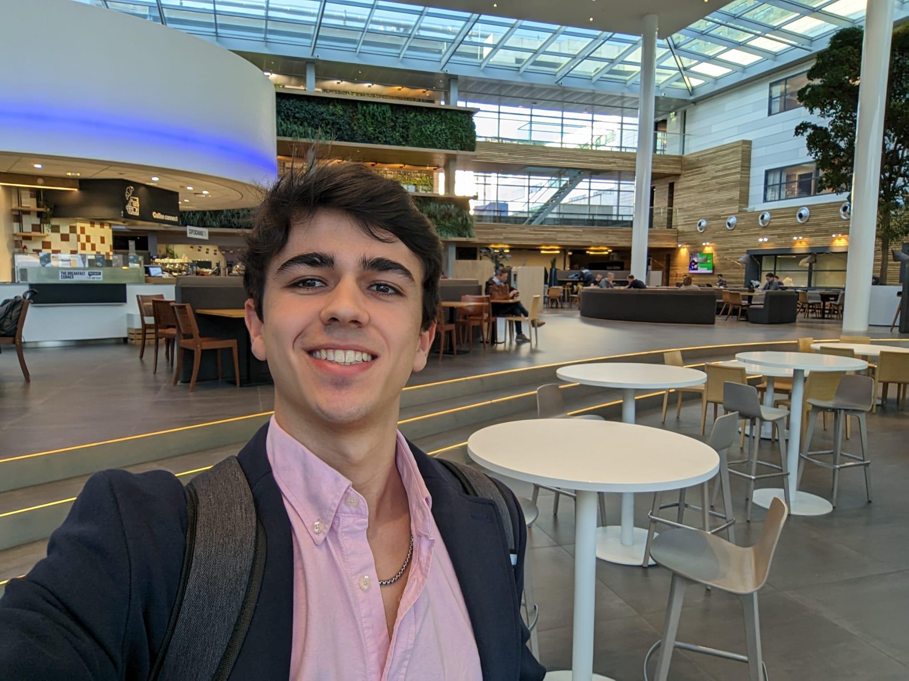

# An ASML intern's thoughts after two months in

I started my four-month internship on February 2nd, 2026. In this post, I will share some personal reflections, technical notes, and my view of the corporate world at one of the leading tech giants of our time

    
    
Building Plaza, where I have lunch every day

In the team I joined - Tribology Research Department - They use several machines that simulate real environment conditions of their EUV systems to do all kinds of experiments on them. Each machine is different from each other, and they generate enormous amounts of data. 

My internship assignment - a very specific one - revolves all around one of these machines, called the "BIT" machine.

Before I joined, the process engineers followed to visualize BIT experiment's data was too tedious - It was a slow, 8 step process that required a lot of effort just to get some "simple" X vs Y graph visualizations. 

This resulted in having a small team of researchers only knowing how to get those visualizations. When an external team would want to see some experiments, they could not freely navigate the database but rather rely on the responsible team to get the visualizations from them.

That is where I come in. The goal of my assignment is to simplify the data visualization pipeline for anyone with access to the database. Note that in this scenario, the visualization step is the most trivial one - simply use an existing library to plot the data - The hardest step is to convert 60 TB of numerical data into something that is instantly accessible. 

> One of the things I really like about this internship is how its goal oriented. As opposed to university where they teach you the tools first then the problems they solve, here it's the other way around: You are given a real problem and you need to figure out the tools to solve it. What's particularly interesting is how the tools usually end up overlapping in both academic and industrial field . Its just that the framing of solving a challenge makes it more appealing to me.

In the beginning of the internship, there were many things that were not clear to me. There were even aspects that I didn't even know I was not contemplating. However, the more time I spent on the project, the clearer the answers to all these questions were in my mind. Not only during deep work focused time, but also in resting time. Knowledge would simply feel more clear on my head after working on the full week and resting for the weekend

One of these questions is *why is the database 60TB big if it only contained numerical data? Can we reduce it?*  Coming from a data science background, I was always used to numerical data being much, much smaller. A few GB's at most. Stored in CSV, parquet, maybe NPY? 

Ignoring this question resulted into me following a non optimal approach to make the pipeline: a client side graph generator. I worked on this approach for the first one and a half months. The result was something that worked but with some downsides: Assumming the end user had access to the code AND could run it (required MATLAB installation, may give compatibility issues), and a slow processing time on the fly.

After having this working version, something clicked in my head: most users just wanted a fast snapshot of the experiment result - we can preprocess and store all the data at once and generate reports for instant access. So the question of why the DB was huge came up again. The answer, was due to this formula:

\\[ S_{total} = N_{exp} \times N_{runs} \times N_{ch} \times (T_{run} \times f_{s}) \times B_{weight} \approx 60\text{ TB} \\]

where:

- \\( N_{exp} \\) is the **total number of experiments** stored in the database.
- \\( N_{runs} \\) is the **number of recording runs** carried out per experiment.
- \\( N_{ch} \\) is the **number of physical/virtual channels** tracked per run.
- \\( T_{run} \\) is the **total duration** of each recording in seconds.
- \\( f_{s} \\) is the **sampling frequency** (Hz) used by the data acquisition system.
- \\( B_{weight} \\) is 8 byte per data point due to 64-bit float.

For a simple visualization, we could reduce:

1. The sampling frequency (99.6% reduction with 1:30 downsampling).
2. The size per datapoint (50% reduction with 32-bit float).
3. The number of channels (30% reduction keeping only important channels).

Additionally we could save everything on a more optimized data format such as .parquet, avoiding unnecessary .mat overhead.

So that is what I did. I wrote a script to preprocess all those runs in parallel using 4 workers which took around 8h to run, resulting in 10gb of highly compressed, clean, plottable data (-   **99.9833% compression** ).

This is where I am now. I can now use all this data to play around, make graphs, and who knows, maybe even do some interesting ML on top of it🤔. I have two more months yet to discover!

My main takeaway from this internship is **do not rush into showing results.** It's better to go slowly and safe on every step  that rather trying to get something flashy to impress your team. Results speak for themselves.

This post ended up being too technical, I will finish it with some bullet points of honest and possibly controversial opinions about my experience as an intern:

 - Interns are a low effort, low expected returns bet that can turn into high ROI if intern is high agency. There are two types of interns: those who ship and those who are just there. 
 - You will fall into the second group if you keep the "uni" mentality- focusing on presentation, burocratics, just showing up - Your team will like you but they won't think of you as competent
 - Being social and open is AS important as shipping - that is how you get opportunities
 - You can just do things within the company

Date: Mar 31, 2026
Overview: Reflections on my first two months as an intern at ASML.
