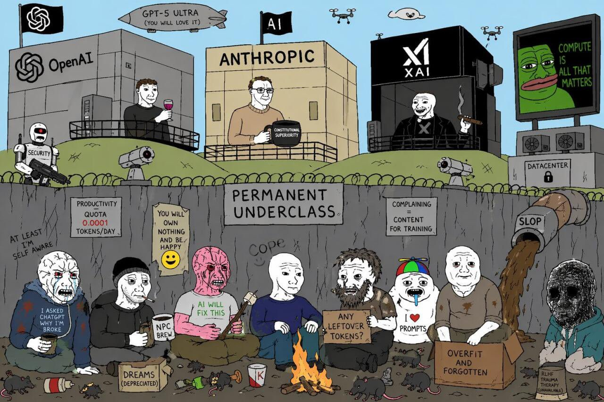
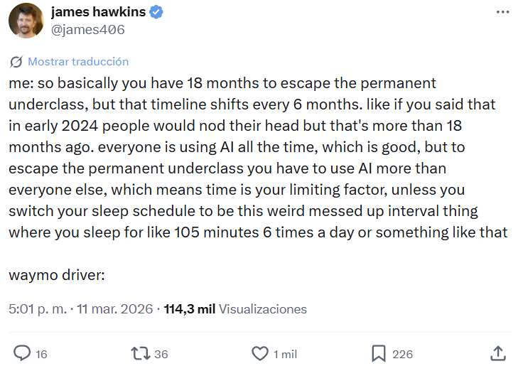
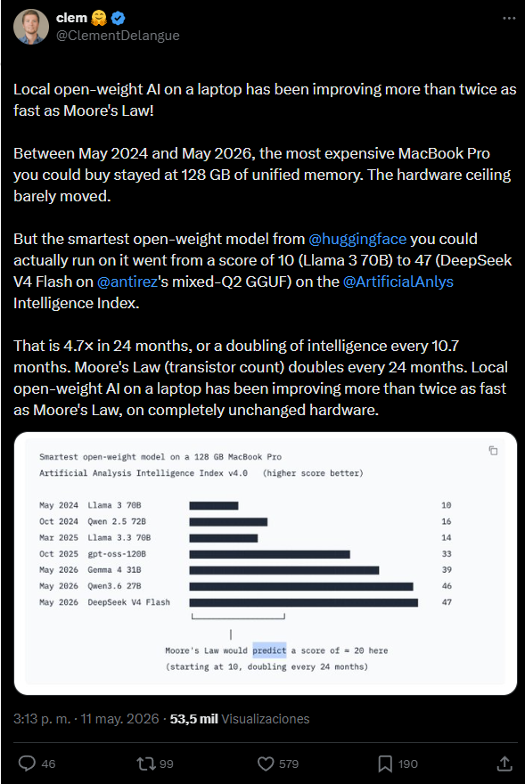
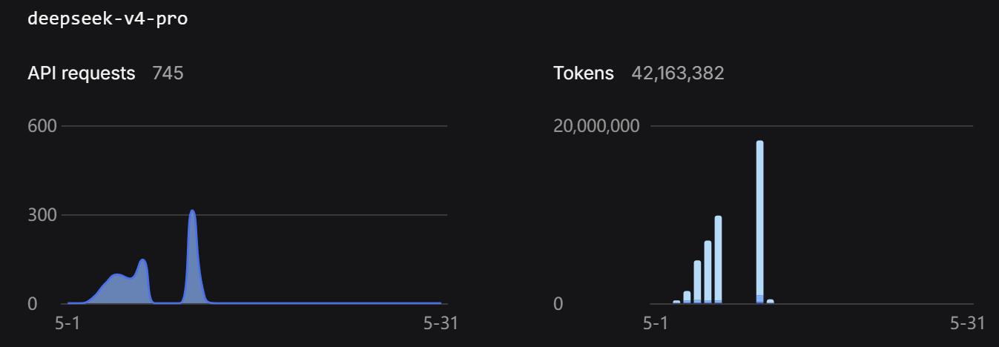

# My Coding Stack in 2026
In 2024 I had a heated discussion with an italian girl who said AI would create inequalities - I was completely oposed to that view.

Looking back, the girl was right. 

AI created *the permament underclass*.

<div align="center">
  
</div>

The good news is: this is about to change in 2026, and in this post I will explain WHY, and how to escape from it

## What's the permanent underclass?
First we need to know what the permanent underclass is. Here is a [great post](https://www.saxifrage.xyz/post/permanent-underclass) that explains it. 

> The permanent underclass are the people without access to the best AI tools, giving them a huge productivity disadvantage compared to those who do. 

I need to note that this term is an exaggeration, an internet meme. Having said that, I do believe it is partly true.

### How did we get there?

In 2024, the AI landscape was much smaller and monopolyzed than right now, mostly dominated by Openai's Chatgpt. 

The AI tools were much simpler and limited. They were "smart google engines": you asked a query in natural language and received a coherent answer back. 

This led me to think: Why would this tool create inequalities if chatgpt is free and available to everyone? Contrarily, it will create more opportunities for everyone!

The error in my argument is that as time passed, the best AI tools started to become **much more exclusive** and **inaccessible for the general population**.

AI tools right now are much more than "smart autocomplete". Many notorious people have admitted how AI can be used to build very complex systems e.g: [Senior Staff Software Engineer @ Google explaining how they use Gemini CLI to ship code](https://www.youtube.com/watch?v=SUG-cEMFKFM&t=60s)


> **The root cause of the permanent underclass is that such exclusive AI tools give a huge advantage over the rest**.

## How AI capabilities improved since chatgpt's appeareance 
Over the past 2 years, a silent revolution in what AI can do has been going on. Not in terms of inherent capabilities - It is still mostly LLM based - But in the sense that LLMs are now **just another cog in the machine**, not the full system. 

The term "Agentic AI" is key here. Agentic systems (or Harnesses) like [Claude Code](https://claude.com/product/claude-code), [Codex](https://chatgpt.com/codex), [Gemini CLI](https://geminicli.com/), [Cursor](https://cursor.com/), [OpenCode](https://opencode.ai/), [Pi.dev](https://pi.dev/), [Hermes Agent](https://hermes-agent.nousresearch.com/), [OpenClaw](https://openclaw.ai/) are super powerful AI agentic tools that can 10x your productivity if used correctly.

On the larger scale, agentic AI has proven to be a viable path, with [examples from 2025-2026 showing verifiable enterprise ROI across finance, retail, healthcare, and software. Klarna’s AI agent saved $60 million and handled the workload of 853 employees by Q3 2025. JPMorgan runs 450+ AI use cases in production daily. Organizations report average returns of 171%, exceeding traditional automation ROI by 3x](https://aimonk.com/agentic-ai-examples-enterprise-roi-case-studies/)


On the individual level, agentic AI is also **super powerful**: for example, a nice use case that I personally use **Pi.dev** for is preparing for my courses. [Here](https://dkealvaro.github.io/notes/Year_1/Q2/Bayesian%20ML/README.html) are the full notes for a course I took in which I got an 8/10 by ONLY studying from the AI generated notes. (Use the naviagtion arrows on the side)

The AI field is in a phase of experimenting what can be done with it, so its use cases are not strictly defined, but I believe that more use cases are yet to be discovered!

## Why cheap AI plans are not enough

In May 2026 these are the current plans for most popular AI plans:

| Tool | Low Tier | Mid Tier | Top Tier |
| :--- | :--- | :--- | :--- |
| **Cursor** | $20/mo (Pro) | $60/mo (Pro+) | $200/mo (Ultra) |
| **Claude Code** | $20/mo (Pro) | $100/mo (Max 5x) | $200/mo (Max 20x) |
| **Codex** | $20/mo (via Plus) | $100–$200/mo | $200/mo (via Pro) |
| **Gemini** | $19.99/mo (AI Pro) | — | $249.99/mo (AI Ultra) |


I have personally used Cursor's and Google (Gemini) low tier for a while, in fact, I still am a user of Gemini AI pro plan.

The low tier plans have a main downside: **They are simply not powerful enough**. The intelligence of their models, as well as their **usage limits** are **too low**, and they change over time, arbitrarily.

> **Having access to a good model with high usage limits and a good harness is the key factor that determines productivity**. 

For example, Gemini AI pro plan offers access to Antigravity, its own integrated development enviroment (IDE) with agentic capabilities and models such as Claude opus 4.6, Gemini 3.1 pro and Gemini 3 Flash.

While 3.1 Pro and Opus 4.6 are top tier, their token limit is so low that after a few prompts, they will cut your access off and you will need to wait 5 days to use them again.

On top of it, the very  best models are only available in the top tier plans, such as Opus 4.7 or GPT-5.5 (xhigh). Many cases report spending thousands of euros monthly in AI coding plans or tokens:
- ["$5,000. That's my Anthropic API bill. For 30 days. Just me"](https://www.linkedin.com/posts/ericosiu_5000-thats-my-anthropic-api-bill-for-share-7441869078274871296-IjWY/)
- ["I probably spend more than my salary on Claude" - NY times article](https://www.nytimes.com/2026/03/20/technology/tokenmaxxing-ai-agents.html)
- [Startup CEO says he's proud his 4-person team racked up a $113,000 monthly AI bill](https://www.businessinsider.com/startup-ceo-monthly-ai-bill-anthropic-swan-2026-4)

If you don't have access to the best AI tools, you won't realize how powerful AI is right now and will fall into the "permanent underclass"

<div align="center">
  
</div>

The takeaway and TLDR from this is:
> **Access to the best AI tools  is bottlenecked by the amount of money you are willing to pay. Your 20€ monthly chatgpt subscription is a tiny fraction of what AI is capable of doing**.

## The twist - Open Source

Clement Delange, Co-founder & CEO at Hugging Face - one of the most important companies in the AI/Machine learning world - [highlighted a few days ago](https://x.com/ClementDelangue/status/2053825719587815711), how fast open weight AI has been improving over the past two years:

<div align="center">
  <a href="https://x.com/ClementDelangue/status/2053825719587815711">
    
  </a>
</div>

The current state of open source models already opened a huge world of possibilities on what can be done TODAY. The following image shows AI models and their [intelligence index](https://artificialanalysis.ai/) in May 2026. The score is calculated by averaging the model's performance across 10 well known benchmarks such as GPDval, Tau-2 Bench...

<div align="center">
  
</div>

GPT 5.5 xhigh takes the lead with a score of 60. Two models are highlighted, Deepseek V4 Pro and Qwen 3.6 27b, with scores of 52 and 46.

Both are amazing **open weights** models.

- **Deepseek V4 Pro** currently has a 75% discount until May 31, with a input/output price of $0.435/$0.87 per M tokens via their API.

- **Qwen 3.6 27b** on the other hand **can be run on consumer hardware**.

If you have a GPU with 24+ gb of VRAM, you can run a model with state of the art intelligence from 6 months ago locally, on your own hardware. Meaning no data exits your computer, and no limits in the tokens you can use.

Apart from models, previously talked about how a good harness is also key. The good news is that, some very good open source harness are also available:

## The low-cost AI workflwow in 2026

Remember the AI generated notes I talked about earlier? I made them using [Qwen code](https://qwen.ai/qwencode) with their flagship model back when they had a free trial. When I first tried it, I was amazed by the quality of the results. I had previously tried [Gemini CLI](https://geminicli.com/) and its results were much worse. 

My experience with both harnesses is that, with Gemini CLI, the models felt lazy. I would tell them, "Hey, please make a deep report on this topic," and the output that I would get was very, very short. In Qwen, it would be much more deep, which is what I was looking for.

Still today I wonder why that happened (probably it was the system prompt or some internal configuration), but using both I learned that the **harness you use has a big impact in the outcome of your tasks**.

After trying many set ups, here is the one I use today:
**Antigravity + Pi.dev / Opencode inside WSL using Deepseek V4 Pro / Flash**

### How to set it up
These are  the steps I took for my windows laptop:

Firstly, for the IDE I use [Antigravity](https://antigravity.google/). In case you dont know, an IDE is like file manager with superpowers: it allows you to open and modify files (usually text based). Perfect for any project you'll want to work on! Antigravity comes with its own integrated AI agent which is not bad, but in my experience, its loop is too opaque. I dont know how the underlying instructions the LLM receives, the available tools, the agentic loop, and its behavior varies every update. I use the IDE agent for simple tasks 


I use **pi.dev** as my main AI harness. Pi is an open-source coding agent that takes a minimalist approach. The creator, [Mario Zechner](https://mariozechner.at/), designed it under the philosophy that modern LLMs are already trained to be coding agents and don't need massive, 10,000+ token system prompts explaining how to do their jobs. Here is the default System prompt pi agent receives when you initialize it:
```
You are an expert coding assistant operating inside pi, a coding agent harness. You help users by reading files, executing commands, editing code, and writing new files.

Available tools:
- read: Read file contents (text or images), with optional offset and limit for large files
- bash: Execute bash commands (ls, grep, find, etc.)
- edit: Make precise file edits with exact text replacement, including multiple disjoint edits in one call
- write: Create or overwrite files

In addition to the tools above, you may have access to other custom tools depending on the project.

Guidelines:
- Prefer grep/find/ls tools over bash for file exploration (faster, respects .gitignore)
- Use edit for precise changes (edits[].oldText must match exactly)
- When changing multiple separate locations in one file, use one edit call with multiple entries in edits[] instead of multiple edit calls
- Each edits[].oldText is matched against the original file, not after earlier edits are applied. Do not emit overlapping or nested edits. Merge nearby changes into one edit.
- Keep edits[].oldText as small as possible while still being unique in the file. Do not pad with large unchanged regions.
- Use write only for new files or complete rewrites.
- Be concise in your responses
- Show file paths clearly when working with files

Pi documentation (read only when the user asks about pi itself, its SDK, extensions, themes, skills, or TUI):
- Main documentation: /path/to/pi/README.md
- Additional docs: /path/to/pi/docs
- Examples: /path/to/pi/examples (extensions, custom tools, SDK)
- When asked about: extensions (docs/extensions.md, examples/extensions/), themes (docs/themes.md), skills (docs/skills.md), prompt templates (docs/prompt-templates.md), TUI components (docs/tui.md), keybindings (docs/keybindings.md), SDK integrations (docs/sdk.md), custom providers (docs/custom-provider.md), adding models (docs/models.md), pi packages (docs/packages.md)
- When working on pi topics, read the docs and examples, and follow .md cross-references before implementing
- Always read pi .md files completely and follow links to related docs (e.g., tui.md for TUI API details)

Current date: 2026-05-12
Current working directory: /home/ubuntu/project
```

By reading the system prompt, you will notice how Pi follows [Karpathy's Software 3.0 idea](https://www.youtube.com/watch?v=96jN2OCOfLs) of letting the AI do the work rather than explicitly hardcoding functionalities in the code itself: 

Instead of having a system prompt with thousands of lines with information it will never use, the prompt simply stores where the information lies. So in case the user asks for that information (e.g how pi agent works), the agent can use its tools to find and read the necessary files. Pi simplicity makes it more deterministic and predictable, and so far I like to work with it!

An advantage about pi is that its **agent agnostic**. You can easily use any model from different providers as far as they use a well known compatible api (e.g Openai API or Anthropic API), so you can use local models if you have the hardware!

I will continue using Deepseek V4 Pro until the discount finishes in the end of May. Probably by then, a more powerful and cheaper model has been released! My strategy to find good models is to look at the *Intelligence vs. Cost to Run* plot in [artificialanalysis.ai](https://artificialanalysis.ai/) and also staying up to date in X/Twitter.

I use deepseek directly from their official api provider. To do so, I created an account in platform.deepseek.com, got an api key and added 10€. Over the last 10 days I burned **42 milion** tokens (Although only 0.1% of them being output tokens) for the price of **$1.41**
<div align="center">
  
</div>

Occassionally, if I need subagents I use [OpenCode](https://opencode.ai/). It is Pi's big brother. It has more functionalities and the solution is more mature. They are currently offering a 10€ pm plan with very generous limits and access to powerful models such as Kimi K2 (score of 54 in artificialanalysis.ai) - I havent personally tried that plan but will probably do in the future

In order for the agent to use native unix tools to navigate folders (e.g. grep/find/ls), I installed both Pi and Opencode in **WSL**, a powerful windows feature that lets you run a linux enviroment sharing the network and files with windows.

To set it up youjust have to open a terminal as admin and type: wsl --install. Then, you can activate it with the command *wsl*. 

Once inside, to install pi: npm install -g @earendil-works/pi-coding-agent

After this, you are free to explore the exciting world of agentic AI, and just maybe, exit the permanent underclass

## TLDR (Written by Pi)

> **The permanent underclass is real - but it doesn't have to be permanent.**

Here's the reality of coding in 2026:

- **Cheap AI plans are a trap.** $20/mo gets you rate-limited after a few prompts. The best models (Opus 4.7, GPT-5.5 xhigh) are locked behind $200+/mo plans, and some people spend **thousands per month** just to stay competitive.

- **Agentic AI is the real deal.** Harnesses like Pi.dev, OpenCode, and Claude Code can 10x your productivity — but only if you have access to good models with high limits.

- **Open source is the escape hatch.** Deepseek V4 Pro (score 52) and Qwen 3.6 27b (score 46) rival proprietary models, and Qwen 3.6 **runs on consumer hardware**. No rate limits, no data leaving your machine.

- **My stack costs almost nothing.** Antigravity IDE + Pi.dev inside WSL + Deepseek V4 Pro API. I burned **42 million tokens in 10 days for $1.41**. That's the price of a coffee.

- **The harness matters as much as the model.** After trying Gemini CLI, Qwen Code, and Pi.dev, I learned that the agent's system prompt and tooling dramatically affect output quality. Pi's minimalist philosophy (letting the LLM use tools to find information instead of stuffing it all in the prompt) makes it more predictable and deterministic.

The bottom line: you don't need a $5,000/month API bill to escape the permanent underclass. With open-weight models, open-source harnesses, and a bit of setup, you can get **90% of the way there for 0.03% of the cost**.

Date: May 7, 2026
Overview: The tools I use to code in 2026