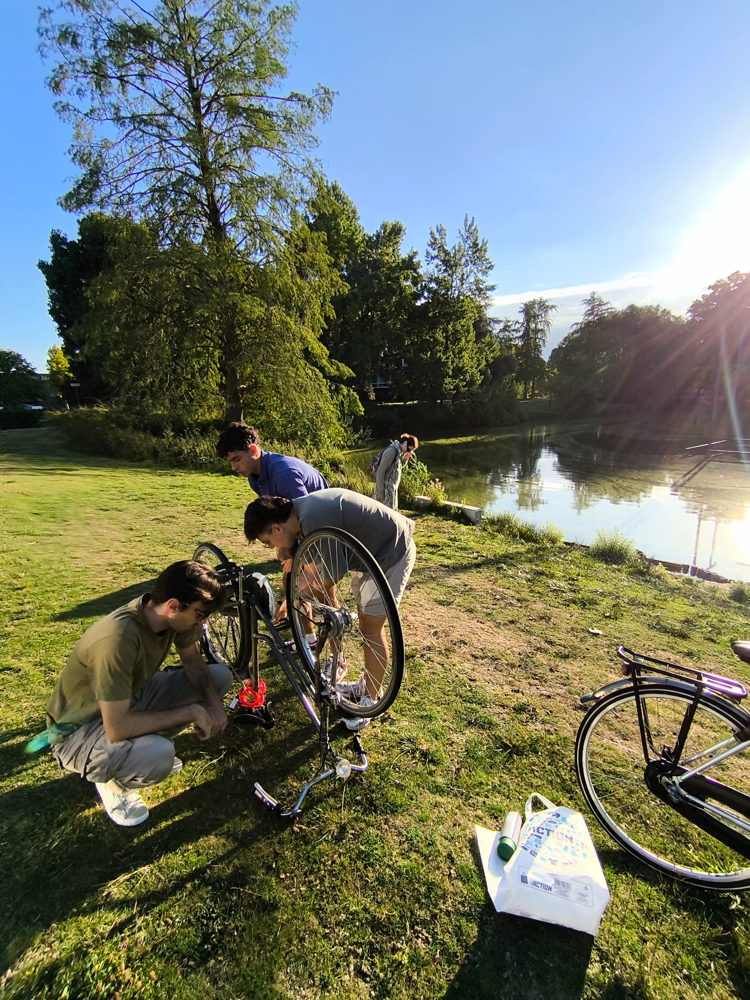
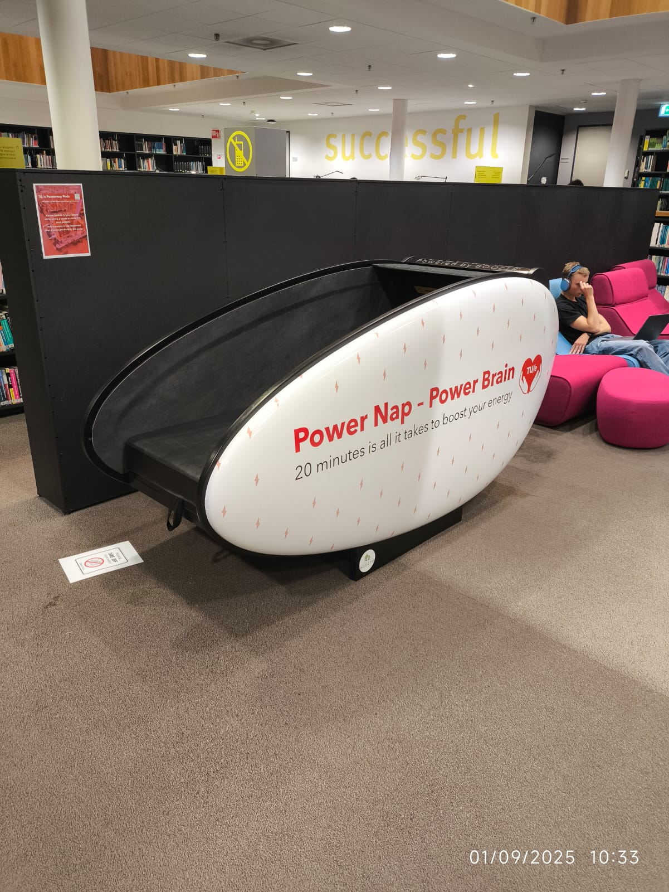
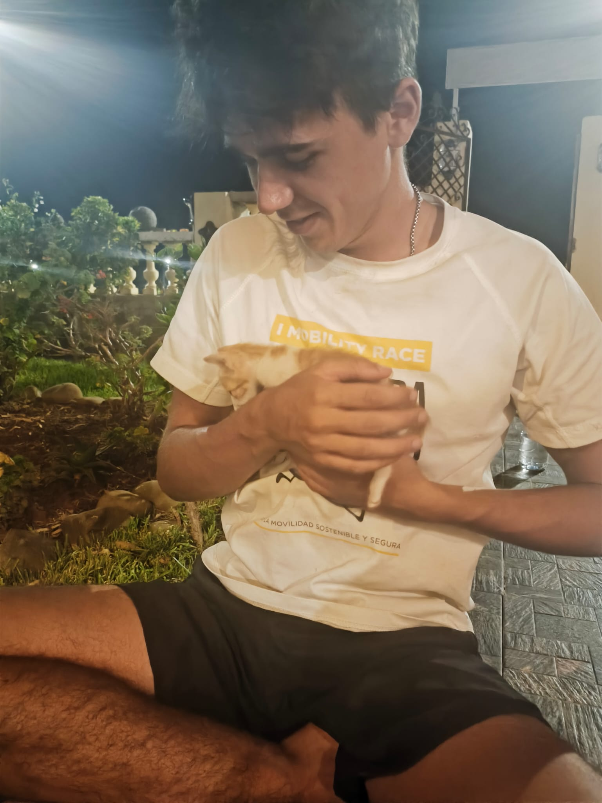
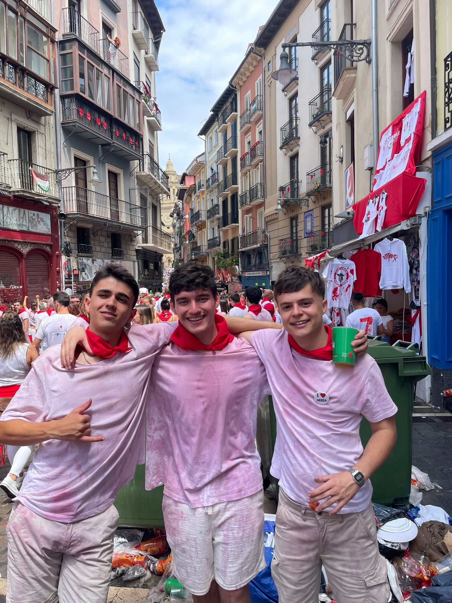

# End of summer and starting my Master's degree in AI!
I havent written here in a while. It's not that I stopped coding and shipping 👀, but more that Linkedin is completely empty during summer. Anyway, I had a GREAT time this summer. I was'nt expecting many cool plans but it ended up being really cool. I would highlight three different trips I did: *Santander*, *Ceuta-Melilla 6 day Bike trip* and *San Fermines*. Each one had their unique bits that made them amazing. Dont worry, I will go more into details about them in the pictures below!

  

    
    
My new friends and I in some random park in Eindhoven painting a bike

  

  

    
    
My brand new student card 😎

  

  

    
    
Turns out Eindhoven has bunk beds to allow students to take naps! 

  

  

    
    
A selfie we took in Algeciras before getting into the ferry to Ceuta 

  

  

    
    
The route we did biking! That big hill in the middle was really difficult.

  

  

    
    
An amazing goodbye party my friends and I did

  

  

    
    
A super cute cat😻 we met at Cala Iris. I should of taken him home...

  

  

    
    
An unforgettable trip we did to Pamplona. We ran in front of the bulls

  

After this recap, I want to write about the plans and expectations I have for the following two years while I'm completing my new degree. 
Here are the things I WOULD like to do/achieve: 
- Complete the degree in the expected time, no extra semester. 
- At least a 8 GPA
- Get a student job in the following month, and stay there for 6-12 months
- Get an internship/qualified job in the second half of 2025 or in 2026
- Go as much as I can to Madrid. I cannot commit to this though cause it depends more on my economic 
I dont have much left to say, just that Im so happy for the opportunity that has been given to me and I hope to be up to expectations!

Date: Sep 2, 2025
Overview: Summer 2025 recap and Master kick-off!