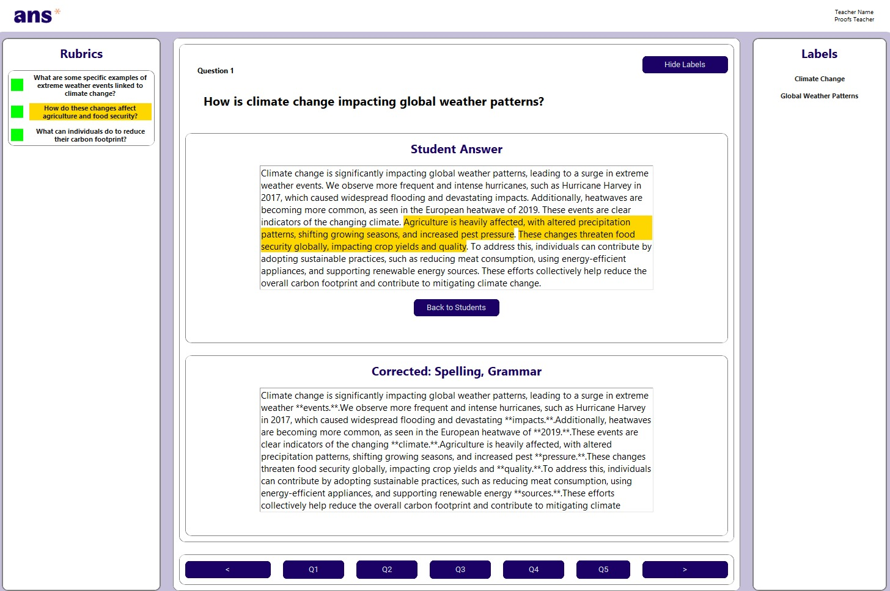
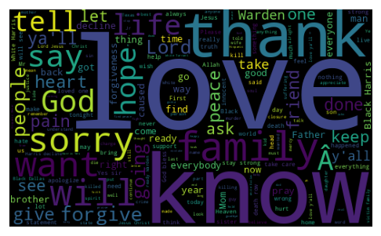

# Alvaro Menendez

[Gmail](mailto:alvaro.mrgr@gmail.com) | [LinkedIn](https://www.linkedin.com/in/alvaro-menendez-ros-42b76424a/) | [GitHub](https://github.com/DKeAlvaro)

---

## Summary

I am currently a third year `Data science` and `AI` student. Out of all the technical abilities I have learned during my higher education, the one I value most is the ability of **tackling problems I have never seen before**. I might not find the solution, but i am definitely not going to stand by idly!

---

## Education

### BSc Data Science & AI - Maastricht University
*Currently studying*, _Aug 2021_ - _Jun 2024_
- Relevant Coursework: Machine learning, Data analysis, Natural Language Processing, Data structures & algorithms, Recommender Systems

---

## Skills

- Technical Skills: [Java](https://www.java.com/es/), [Python](https://www.python.org/), [SQL](https://en.wikipedia.org/wiki/SQL), [Matlab](https://www.mathworks.com/products/matlab.html)
- I can use most well known python libraries such as [Pandas](https://pandas.pydata.org/), [NumPy](https://numpy.org/), [SKlearn](https://scikit-learn.org/stable/), [Keras](https://keras.io/), [Matplotlib](https://matplotlib.org/)
- I have hands-on experience with [OpenAI api](https://openai.com/blog/openai-api).

---

## Projects

- ### Fair Feedback Systems for Academic Assessment using LLMs
We performed a project together with Dutch company [Ans](https://ans.app/landing) in which we aimed to help teachers grade exams by assesing how well a student's answer matched the rubric criteria for that question. We tried several state-of-the-art Large Language Models (*LLM's*) for this task such as [BERT](https://huggingface.co/docs/transformers/model_doc/bert), [LLama2](https://huggingface.co/blog/llama2), [Gemini](https://deepmind.google/technologies/gemini/), [GPT-3.5](https://openai.com/blog/gpt-3-5-turbo-fine-tuning-and-api-updates) and evaluated them on *The Stanford Question Answering Dataset* ([SQUAD](https://rajpurkar.github.io/SQuAD-explorer/)). The final product was displayed on a simple GUI that can be seen below:

  

&nbsp;
We made a (non-published) paper about it and can be downloaded here:
<a href="assets\ANS\Project_3_1.pdf" download="Ans_project.pdf" style="display: inline-block; text-decoration: none; color: white; background-color: #3d3787; padding: 10px 20px; border-radius: 5px; font-size: 12px;">Download </a>

We also had to present our product to an audience! Here are two pictures from the event:

  <ol class="carousel-indicators">
    <li data-target="#carouselExampleIndicators" data-slide-to="0" class="active"></li>
    <li data-target="#carouselExampleIndicators" data-slide-to="1"></li>
  </ol>
  

    

      
    

    

      
    

  

  <a class="carousel-control-prev" href="#carouselExampleIndicators" role="button" data-slide="prev">
    
    Previous
  </a>
  <a class="carousel-control-next" href="#carouselExampleIndicators" role="button" data-slide="next">
    
    Next
  </a>

&nbsp;
- ### Sentiment Analysis of inmates Last Statements using Natural language processing (NLP)
We performed a study to analyze the Last Statements from Inmates executed in texas since 1984 using NLP techniques and models such as [BERT](https://huggingface.co/docs/transformers/model_doc/bert) or [N-Gram frequency analysis](https://en.wikipedia.org/wiki/N-gram). The data is publicly available and can be seen [here](https://www.tdcj.texas.gov/death_row/dr_executed_offenders.html). A wordcloud of the last statements can be seen below.

  

&nbsp;
We made a (non-published) paper about it and can be downloaded here:
<a href="assets/Inmates_last_words/NLP_Project-2.pdf" download="NLP_project.pdf" style="display: inline-block; text-decoration: none; color: white; background-color: #3d3787; padding: 10px 20px; border-radius: 5px; font-size: 12px;">Download </a>

- ### 3D golf project from scratch and developing a bot that made hole in one's!
We developed a 3D mini-golf project using [LibGDX](https://libgdx.com/) for the GUI, then using [Runge-Kutta methods](https://en.wikipedia.org/wiki/Runge%E2%80%93Kutta_methods) to estimate the position of the ball at every moment. The problem of finding a hole in one can be seen as minimizing a 2D function where the independent variable is the final distance of the shot given the initial x and y velocities. For this we used hill climbing and gradient descent to find the global minima of this function (see image below for the function to minimize). This turned out to be very useful as it is widely used in Machine Learning.

  
  

The github repository for this project can be accessed [here](https://github.com/DKeAlvaro/Project-1.2)

## Projects Under developement
- ### Data Analysis project: Analyzing customer behavior of an E-Commerce
In my current course of `Data Analysis`, we are given the opportunity to analyze a dataset of our choice. We will find a Dataset from [Kaggle](https://www.kaggle.com/), use `Python` libraries such as Pandas, Matplotlib, NumPy and Sklearn. Through these tools, we aim to identify patterns and insights that can help improve business strategies.

## Languages

- Spanish: Native speaker
- English: Fluent

Finally, a pdf version of my CV can be downloaded here:
<a href="assets\CV\My_CV.pdf" download="cv.pdf" style="display: inline-block; text-decoration: none; color: white; background-color: #3d3787; padding: 10px 20px; border-radius: 5px; font-size: 12px;">Download CV</a>

- ## Send me an E-mail

  <form action="https://formspree.io/f/mdoqewgw" method="POST">
    <label for="name">Name:</label> 
    <input type="text" id="name" name="name" placeholder="Your name"> 
    <label for="email">Email:</label> 
    <input type="email" id="email" name="_replyto" placeholder="Your email"> 
    <label for="message">Message:</label> 
    <textarea id="message" name="message" placeholder="Your message here"></textarea> 
    <button type="submit">Send</button>
  </form>

