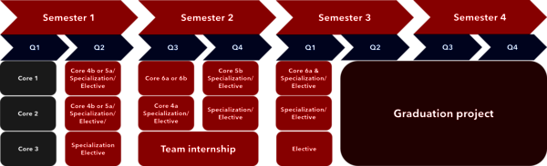
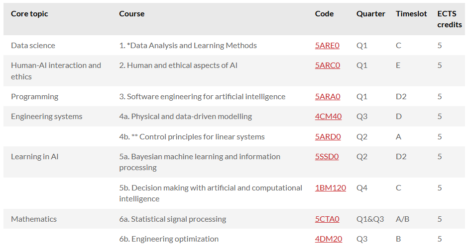

# Quartile 1 Guide

> **TLDR;** register for courses Data Analysis and Learning Methods (**5ARE0**), Human and ethical aspects of AI (**5ARC0**) and Software engineering for artificial intelligence (**5ARA0**).

Below is the degree structure:

As we can see, the master lasts 2 years and each year has 4 quartiles (Q1, Q2, Q3, Q4). In total, there are **6 core courses**. All the core courses are:

Out of the 6 core courses, the first three **are mandatory in Q1** 
1. *Data Analysis and Learning Methods*
2. *Human and ethical aspects of AI*
3. *Software engineering for artificial intelligence*. 

For core courses courses 4, 5 and 6 you can pick between two options, *a* and *b*.

Overview: Baby steps for the first quartile of the MSc AI & Eng Systems at TU/e. Deciphers which courses to enrol and the structure of the program

Date: 1 Sep 2025

